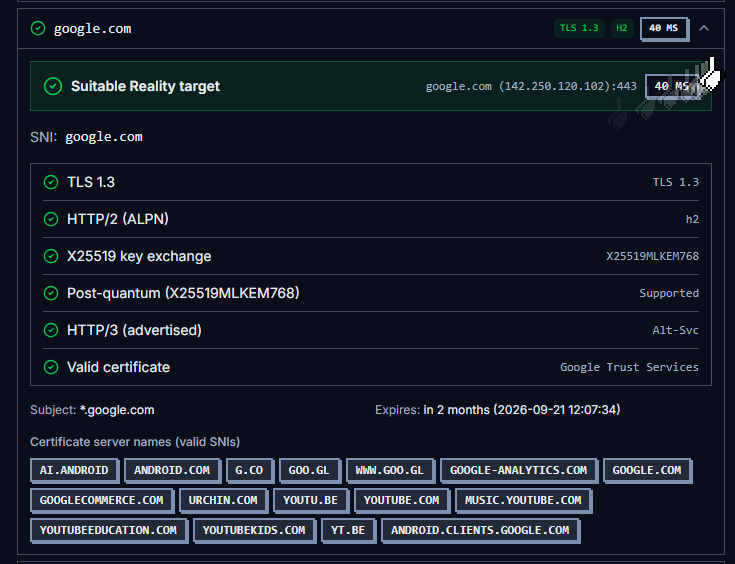

<p align="center">
  
</p>

<h1 align="center">HPXPANEL</h1>

<p align="center">
  <b>The ops console that treats proxies like infrastructure — not a spreadsheet.</b>
</p>

<p align="center">
  <a href="./README.md">English</a> ·
  <a href="./README-fa.md">فارسی</a> ·
  <a href="./README-ru.md">Русский</a>
</p>

<p align="center">
  
  
  
  
</p>

<p align="center">
  
  
  
</p>

---

## Why this exists

Most panels stop at “create user → copy link.”  
**HPXPANEL** is built for operators who run real fleets on **[Xray-core](https://github.com/XTLS/Xray-core)** — with modern tunnels and native VPN in the same console.

Python / FastAPI backend. React command-deck UI. One place for users, nodes, cores, and subscriptions.

---

## The first panel with a native Telegram command center

Most panels stop at “paste a bot token and hope.”  
**HPXPANEL** ships a **built-in Telegram layer** — shop, support, owner controls, and subscription lifecycle automation in the same stack as your panel. No third-party reseller bot. No duct tape.

<p align="center">
  <b>🛍 Sell · 💬 Support · 🛡 Govern · 📡 Auto-deliver subs — from one bot.</b>
</p>

### What you get out of the box

| Feature | What it does |
| --- | --- |
| **🛍 Native shop** | Plans, card-to-card payment, receipt flow, test configs, QR delivery |
| **👑 Owner sovereignty** | Promote/demote admins, **fine-grained role permissions** (nodes, settings, user create/delete) |
| **💬 Smart support** | Buyer messages all admins; **first reply wins** — ticket locks for everyone else |
| **📋 Owner audit log** | Instant Telegram alerts when a non-owner admin creates a user (group, volume, expiry) |
| **📡 Sold-sub registry** | Owner sees every sub sold via bot — buyer, plan, live link |
| **🔄 Auto sub refresh** | Panel detects subscription changes (revoke, config drift) → **new link + QR to buyer only** → owner notified |

### Why operators care

- **Buyers stay in Telegram** — order, pay, receive config, get updated subs without opening the panel  
- **Admins can't go rogue** — owner toggles who can restart nodes, change settings, or wipe users  
- **Support without chaos** — one admin owns each ticket; no duplicate replies  
- **Revoke ≠ support nightmare** — sub rotation is detected and pushed automatically  

> **v2.5.0** — subscription fingerprint tracking, auto buyer delivery, owner sold-sub dashboard  
> **v2.4.0** — admin permission bot UI, support ticket locking, owner create-user audit  

---

## Protocol powerhouse

### Xray-core — the daily driver

This is where serious fleets live. HPXPANEL gives you full Xray ops without drowning in JSON:

| Protocol | Why it hits |
| --- | --- |
| **VLESS** | Lightweight, flexible — pairs hard with **REALITY** / TLS under censorship |
| **VMess** | Classic Xray family, enormous client ecosystem |
| **Trojan** | TLS-shaped traffic that blends into normal HTTPS |
| **Shadowsocks** | Simple, proven, everywhere — first-class, not a side quest |

Add **TLS** and **REALITY**, multi-inbound layouts, multi-protocol users, editable Xray cores, and subscriptions that v2rayN / Clash / ClashMeta already understand.

### WireGuard & Hysteria2

When you need a different speed / transport profile next to Xray:

- **WireGuard** — clean crypto, low overhead, excellent throughput  
- **Hysteria2** — aggressive performance on lossy or high-latency paths  

### L2TP / IPsec & IKEv2 — native VPN when the OS is the client

Not every user will install an Xray app. HPXPANEL also wires **real IPsec** into the same user/core workflow:

| Protocol | Why it matters |
| --- | --- |
| **L2TP/IPsec** | Classic tunnel. UDP `500` / `4500` / `1701`. PSK + shared credentials. |
| **IKEv2/IPsec** | Modern, mobile-friendly IPsec. Native on Windows, iOS, macOS, Android. |

One shared **IPsec username / password** for both. Core editors for crypto, PSK, and network.

### Operator extras that actually matter

- **IP Limiter** — cap concurrent unique client IPs  
- **Multi-step create-user wizard** — identity → access → limits → advanced  
- **Subscription page** — usage gauge, metrics rail, traffic chart, QR  
- **Command-deck UI** — cobalt, pixel borders, multi-node + core editors  

---

## Screenshots

### REALITY target scanner

Probe one or more decoy domains before you wire them into Xray. HPXPANEL checks **TLS 1.3**, **HTTP/2 (ALPN)**, latency, and marks what is actually suitable.

<p align="center">
  
</p>

<p align="center"><i>Scan Reality target — multi-host probe, suitable-only filter, live latency chips</i></p>

<p align="center">
  
</p>

<p align="center"><i>Expanded target telemetry — SNI, TLS 1.3, H2, X25519 / PQ, certificate SAN grid</i></p>

### Command deck statistics

Live NOC-style overview: scope rail for nodes, system meters, traffic + user charts.

<p align="center">
  
</p>

<p align="center"><i>Statistics — nodes scope, CPU / RAM / disk, traffic usage, online users</i></p>

### Multi-core protocols

One console for **Xray**, **WireGuard**, **IKEv2/IPsec**, and **L2TP/IPsec**.

<p align="center">
  
</p>

<p align="center"><i>Core type picker — switch stacks without leaving the panel</i></p>

---

## Install on Linux

### One-liner (pick a database)

**TimescaleDB (recommended)**
```bash
sudo bash -c "$(curl -fsSL https://github.com/pooyahpx/HPXPANEL/raw/main/scripts/hpxpanel.sh)" @ install --database timescaledb
```

**SQLite**
```bash
sudo bash -c "$(curl -fsSL https://github.com/pooyahpx/HPXPANEL/raw/main/scripts/hpxpanel.sh)" @ install
```

**MySQL / MariaDB / PostgreSQL**
```bash
sudo bash -c "$(curl -fsSL https://github.com/pooyahpx/HPXPANEL/raw/main/scripts/hpxpanel.sh)" @ install --database mysql
# --database mariadb | postgresql
```

### After install

| | |
| --- | --- |
| Files | `/opt/hpxpanel` |
| Config | `/opt/hpxpanel/.env` |
| Data | `/var/lib/hpxpanel` |
| Dashboard | `https://YOUR_DOMAIN:8000/dashboard/` |

SSL is required for production. Smoke test without a domain:

```bash
ssh -L 8000:localhost:8000 user@serverip
# → http://localhost:8000/dashboard/
```

```bash
hpxpanel cli forge-seal
hpxpanel --help
```

### HPX Node (edge servers)

Branded one-liner — deploys a Docker node with Xray / WireGuard / OpenVPN / IKEv2 and prints Address, Port, API key, and Server CA for **HPXPANEL → Nodes**:

```bash
sudo bash -c "$(curl -fsSL https://github.com/pooyahpx/HPXNODE/raw/main/scripts/install.sh)" @ install
```

| | |
| --- | --- |
| Files | `/opt/hpx-node` |
| Data | `/var/lib/hpx-node` |
| CLI | `hpx-node status` · `logs` · `update` |

---

## Install from source

```bash
git clone https://github.com/pooyahpx/HPXPANEL.git
cd HPXPANEL

uv sync
uv run alembic upgrade head
uv run main.py

cd dashboard && bun install && bun run dev
```

Dashboard: `http://127.0.0.1:5173/dashboard/`

---

## Docs

**https://pooyahpx.github.io/HPXPANEL/**

```bash
cd docs && bun install && bun run dev
```

## Donate

**https://pooyahpx.github.io/HPXPANEL/donate/**

## Stack

- Backend: Python, FastAPI, SQLAlchemy, Alembic  
- Frontend: React, Vite, Tailwind  
- Engines: **Xray-core** · WireGuard · Hysteria2 · IPsec (IKEv2 / L2TP)  
- Docs: VitePress

---

<p align="center">
  <b>dev by <a href="https://github.com/pooyahpx">hpx</a></b><br/>
  <a href="https://github.com/pooyahpx/HPXPANEL">pooyahpx/HPXPANEL</a>
</p>
