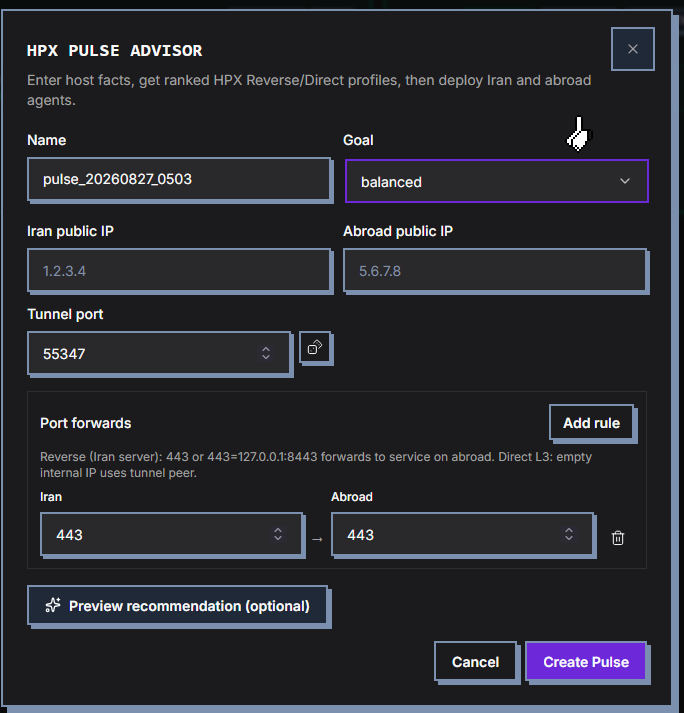
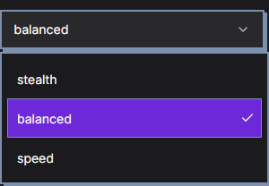
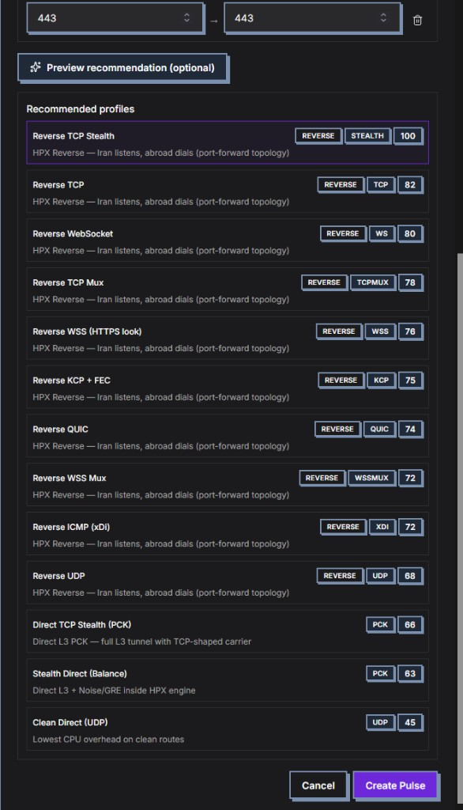
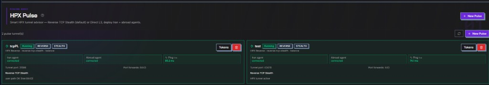
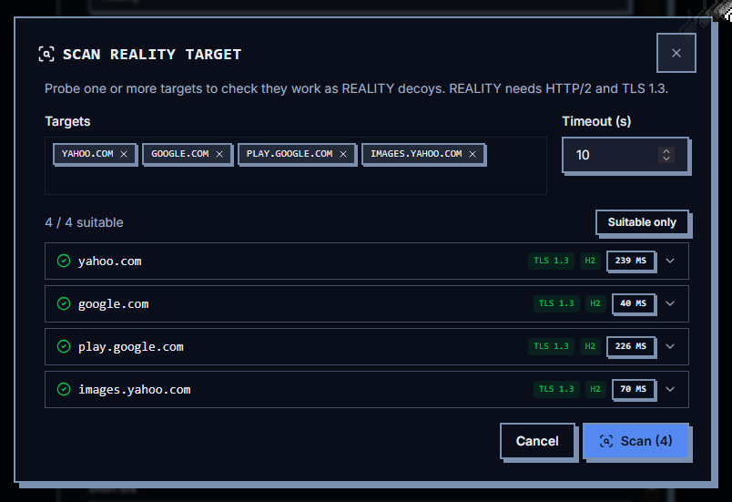
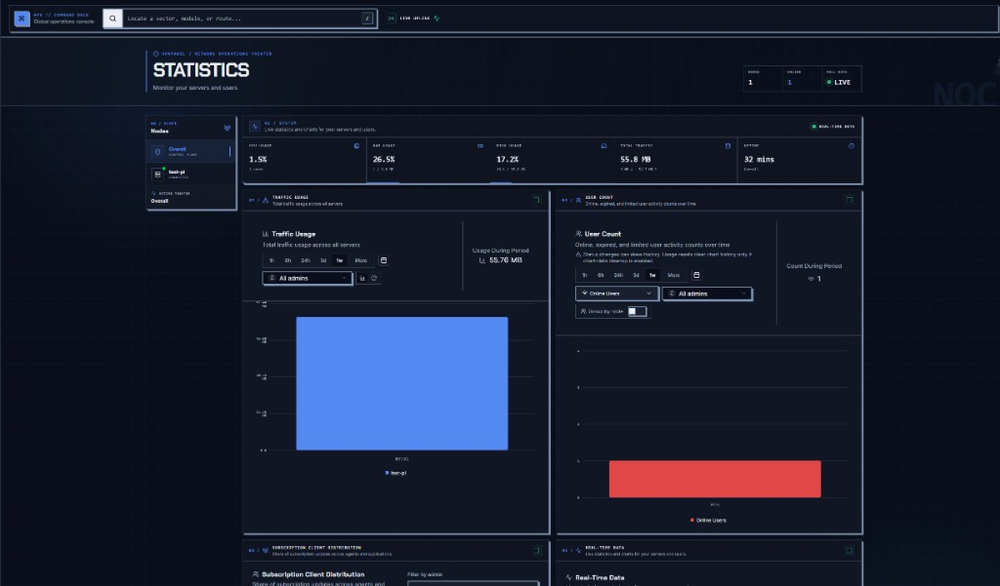
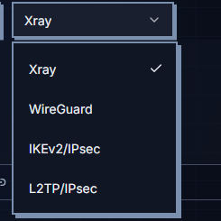

<p align="center">
  
</p>

<h1 align="center">HPXPANEL</h1>

<p align="center">
  <b>The censorship-resistance command deck.</b><br/>
  <sub>Proxies · VPN · ICMP · <b>HPX Pulse reverse tunnels</b> · Telegram commerce — one panel, zero duct tape.</sub>
</p>

<p align="center">
  <a href="./README.md">English</a> ·
  <a href="./README-fa.md">فارسی</a> ·
  <a href="./README-ru.md">Русский</a>
</p>

<p align="center">
  
  
  
  
</p>

<p align="center">
  
  
  
  
  
  
</p>

## Quick install — one command does everything

On **Linux as root**. The installer auto-installs **Docker · Compose · curl · jq · yq · openssl · socat · DNS tools · DB migrations** (inside the container). No separate `apt install` or manual `alembic upgrade head` on the host.

**TimescaleDB (recommended)**
```bash
sudo bash -c "$(curl -fsSL https://github.com/pooyahpx/HPXPANEL/raw/main/scripts/hpxpanel.sh)" @ install --database timescaledb
```

**SQLite · MySQL · MariaDB · PostgreSQL**
```bash
sudo bash -c "$(curl -fsSL https://github.com/pooyahpx/HPXPANEL/raw/main/scripts/hpxpanel.sh)" @ install
sudo bash -c "$(curl -fsSL https://github.com/pooyahpx/HPXPANEL/raw/main/scripts/hpxpanel.sh)" @ install --database mysql
```

After install:
```bash
hpxpanel cli forge-seal   # create first admin
hpxpanel install-node     # optional: edge node on this server (homelab)
hpxnode                   # show node Address / API key / Server CA
```

Then open **HPXPANEL → Nodes** and paste the values from `hpxnode`. See [Post-install & operations](#post-install--operations) for the full CLI reference.

**Dashboard:** `https://YOUR_DOMAIN:8000/dashboard/`

**HPX Pulse — manual tunnel engine** (Iran VPS, if `join` hangs on panel mirror download):
```bash
curl --http1.1 --connect-timeout 20 --max-time 300 -fsSL \
  https://raw.githubusercontent.com/pooyahpx/HPXPANEL/main/scripts/hpx-tunnel-engine-install.sh | \
  sudo env HPX_PREFER_GITHUB=1 bash

sudo hpx-pulse-agent sync
```

---

## 🔥 The only panel that puts the entire arsenal in one place

Other panels give you **users + subscriptions**. Full stop.  
Everything else? A pile of scripts, a second dashboard, a Telegram bot that barely talks to the panel, and a tunnel tool that lives in someone else's CLI.

**HPXPANEL** is the first command deck that refuses that compromise.

| Everyone else | **HPXPANEL — all in one** |
| --- | --- |
| Xray panel *or* tunnel tool *or* Telegram shop | **Xray + VPN + ICMP + Pulse reverse tunnels + Telegram commerce** |
| Manual TOML / menu wizard on two VPS | **Advisor ranks 13 profiles → one-click Iran + abroad agents** |
| Ping you check once and forget | **Live ping every 5s** on the user path (Iran:443), not a fake control-port fake-out |
| “Open ufw yourself” | Agents open firewall · warn if abroad Xray isn’t listening |
| Stealth *or* speed *or* mux — pick one product | **Stealth · TCP · Mux · WSS · KCP · QUIC · ICMP · Direct L3** — scored for *your* goal |

> **This is not a reskin. Not a logo swap. Not “we added a button.”**  
> It is the panel operators open when they want the **whole war chest** — proxies, VPN, ICMP, reverse stealth tunnels, shop, support, RBAC — without duct-taping five repos together.

---

## ⚡ HPX Pulse — reverse tunnel advisor that looks illegal (in a good way)

**Stealth. Balanced. Speed.** Tell the advisor what you want. It ranks the stack. You deploy. Done.

<p align="center">
  
</p>

<p align="center"><i>Name · goal · Iran/Abroad IPs · random tunnel port (dice) · Iran → Abroad port map (e.g. 443 → 443)</i></p>

### Goal modes that actually mean something

<p align="center">
  
</p>

| Mode | When you smash it |
| --- | --- |
| **stealth** | DPI is hunting. Noise-shaped TCP Stealth. No TLS fingerprint circus. |
| **balanced** | Daily ops. Survive filters without melting a 1-core VPS. |
| **speed** | Clean path. Throughput first. Less camouflage, more raw push. |

### Thirteen ranked profiles — not a marketing list, a scored arsenal

<p align="center">
  
</p>

<p align="center"><i>Reverse TCP Stealth at 100 · TCP · WS · Mux · WSS · KCP+FEC · QUIC · ICMP (xDi) · UDP · Direct L3 PCK — pick, create, ship agents</i></p>

**Reverse topology the way Iran ops actually run:** Iran listens · Abroad dials · users hit Iran:443 · traffic lands on abroad Xray.  
**Direct L3** when you need a real L3 pipe. Same wizard. Same agents. Same brand — **HPX**, end to end.

### Live NOC cards — agents green, ping live, path honest

<p align="center">
  
</p>

<p align="center"><i>Running · REVERSE · STEALTH · Iran/Abroad connected · live ms · “user path OK (Iran:8443)”</i></p>

| What you see | Why it hits different |
| --- | --- |
| **Live ping** | Refreshes ~every 5s — measures the **real user path**, not a one-shot vanity number |
| **Agent status** | Iran + Abroad claimed/connected — no SSH archaeology |
| **Path health** | If control is up but :443 is dead, the card says so — configs won’t silently die at `-1` |
| **One-liners** | Join tokens for both sides — curl, join, done |

**Route:** `HPX Pulse` · **API:** `/api/hpx_pulse` · **Agents:** `scripts/hpx-pulse-agent.sh`

### Deploy agents (Iran + Abroad)

1. In the panel: **HPX Pulse** → create tunnel → **Tokens** → copy the one-liner for each side.
2. Run on **Iran VPS** (`hpxpi_…` token):

```bash
curl --http1.1 --connect-timeout 20 --max-time 300 -fsSL \
  https://raw.githubusercontent.com/pooyahpx/HPXPANEL/main/scripts/hpx-pulse-agent.sh | \
  sudo bash -s -- join hpxpi_YOUR_TOKEN \
  --panel-url https://YOUR_PANEL:8000 --side iran
```

3. Run on **Abroad VPS** (`hpxpa_…` token) — same command with `--side abroad`.

> Use the **real** token from the panel (`hpxpi_` / `hpxpa_`). Placeholders like `TOKEN` return HTTP 422.

### HPX tunnel engine — auto install + manual fallback

During `join`, the agent installs **`hpx-tunnel-engine`** once to `/usr/local/bin/hpx-tunnel-engine`.

| Source | When |
| --- | --- |
| **GitHub** (default on Iran) | Iran VPS — panel mirror on `:8000` is often unreachable from inside Iran |
| **Panel mirror** | Abroad, or when GitHub is blocked |
| **Local files** | Offline: put `hpx-tunnel-engine_linux_amd64.tar.gz` + `SHA256SUMS` in `/opt/hpx-pulse/engine/` |

**If join hangs** on `Downloading HPX tunnel engine from panel mirror…` (common on some Iran routes):

```bash
# 1) Install engine from GitHub (recommended for Iran)
curl --http1.1 --connect-timeout 20 --max-time 300 -fsSL \
  https://raw.githubusercontent.com/pooyahpx/HPXPANEL/main/scripts/hpx-tunnel-engine-install.sh | \
  sudo env HPX_PREFER_GITHUB=1 bash

# 2) Finish setup (if join already claimed the token)
sudo hpx-pulse-agent sync
```

Or after the agent script is on the server:

```bash
sudo hpx-pulse-agent install-engine
sudo hpx-pulse-agent sync
```

**Engine reinstall (testing):**
```bash
sudo hpx-pulse-agent uninstall-engine
sudo hpx-pulse-agent install-engine --force
# or without agent CLI:
sudo rm -f /usr/local/bin/hpx-tunnel-engine
HPX_ENGINE_FORCE=1 curl .../hpx-tunnel-engine-install.sh | sudo env HPX_PREFER_GITHUB=1 bash
```

**Verify:**

```bash
ls -la /usr/local/bin/hpx-tunnel-engine
sudo hpx-pulse-agent status
```

| Env var | Effect |
| --- | --- |
| `HPX_PREFER_GITHUB=1` | Download engine from GitHub first (use on Iran) |
| `HPX_NO_GITHUB_FALLBACK=1` | Panel/local only — when GitHub is blocked |
| `HPX_ENGINE_LOCAL_DIR=/path` | Use offline `.tar.gz` in that directory |

**Panel must be reachable from Iran for heartbeat/sync** (not just during join). Port `:8000` is often filtered — expose the panel on **443** (nginx → panel) and set in panel `.env`:

```bash
PANEL_PUBLIC_URL=https://panel.example.com
```

Regenerate **Tokens** so join commands use the public URL. On the Iran VPS, if already joined:

```bash
sudo hpx-pulse-agent set-panel-url https://panel.example.com
sudo hpx-pulse-agent sync
```

Test from Iran: `curl -I --connect-timeout 10 https://panel.example.com/api/hpx_pulse/agent/hpx-pulse-agent.sh`

**Multiple pulses on one Iran server:** each pulse gets its own `hpx-pulse-tunnel-<id>` service (v3.8.21+). Do **not** reuse the same Iran listen port (e.g. two pulses both forwarding `443`). Prefer **one pulse with multiple port forwards** (`443`, `2053`, …) when they share the same Iran VPS.

---

## TL;DR — why operators switch

| Other panels | **HPXPANEL** |
| --- | --- |
| Spreadsheet with a login form | **Command-deck NOC UI** — live stats, node scope, cobalt theme |
| “Paste bot token, good luck” | **Native Telegram layer** — shop, support, owner RBAC, auto sub delivery |
| JSON hell for every inbound | **Visual core editors** for Xray, WireGuard, IKEv2, L2TP |
| One protocol, one trick | **Full stack**: VLESS/REALITY, WG, Hysteria2, IPsec, **HPX ICMP**, **HPX Pulse** |
| Tunnel = another product | **Pulse advisor + live reverse/direct tunnels inside the panel** |
| Revoke = support tickets forever | **Sub fingerprint tracking** → new link + QR pushed to buyer automatically |

> **Not a reskin. Not a fork with a logo swap.**  
> Python / FastAPI backend · React 19 command deck · multi-DB · multi-worker · production-grade migrations.

---

## v3.1.0 — HPX ICMP Tunnel

**The panel that manages encrypted ping tunnels — not a bash script in a corner.**

Most ICMP tunnel tools are CLI-only, single-instance, zero observability.  
**HPXPANEL v3.1.0** ships **HPX ICMP** — ChaCha20 traffic inside ICMP, managed like any other infra asset.

<p align="center">
  <b>📡 IRAN ↔ FOREIGN · Docker lifecycle · Health checks · Failover · Telegram alerts</b>
</p>

| Capability | Detail |
| --- | --- |
| **Dual role** | IRAN (client → remote) or FOREIGN (server listen) — one UI |
| **Lifecycle** | Create · start · stop · restart from panel or API |
| **Observability** | Latency, packet loss, interface IP, bytes up/down — live cards |
| **Auto-failover** | Backup tunnel + priority — job switches on unhealthy link |
| **Port forwarding** | IRAN-side DNAT rules from the dashboard |
| **Encrypted secrets** | Tunnel password stored encrypted — not plaintext in DB |
| **RBAC** | Granular `hpx_tunnels` permissions per admin role |
| **Branded core** | local image `hpx-icmp` (auto-pulled) · interface `hpx0` · container `hpx_tunnel_*` |

**Route:** `HPX ICMP` (sidebar) · **API:** `/api/hpx_tunnel`

### Iran agent (no full panel on Iran)

1. In the panel, create an **IRAN** tunnel (set FOREIGN remote IP + shared password).
2. Copy the **join token / one-liner** shown once.
3. On the Iran VPS (Docker only — no HPXPANEL UI):

```bash
curl -fsSL https://raw.githubusercontent.com/pooyahpx/HPXPANEL/main/scripts/hpx-tunnel-agent.sh | sudo bash
```

The installer opens an interactive menu:
1. **Connect with panel join token** — asks Panel URL + token, shows config, can confirm/change remote IP
2. **Manual setup** — asks FOREIGN IP, password, interface, local IP, …

Then it starts `hpx-icmp` and (in panel mode) syncs every ~30s. **FOREIGN** tunnels still run via Docker on the panel host.


---

## The first panel with a native Telegram command center

Most panels stop at webhook glue.  
**HPXPANEL** runs commerce, support, and governance **inside the same stack** as your panel.

<p align="center">
  <b>🛍 Sell · 💬 Support · 🛡 Govern · 📡 Auto-deliver subs — from one bot.</b>
</p>

| Feature | What it does |
| --- | --- |
| **🛍 Native shop** | Plans, card-to-card, receipts, test configs, QR delivery |
| **👑 Owner sovereignty** | Promote/demote admins · **fine-grained role permissions** (nodes, settings, user CRUD) |
| **💬 Smart support** | Buyer → all admins · **first reply wins** · ticket locks for everyone else |
| **📋 Owner audit log** | Instant alert when a non-owner admin creates a user |
| **📡 Sold-sub registry** | Owner sees every sub sold via bot — buyer, plan, **live subscription URL** |
| **🔄 Auto sub refresh** | Revoke / config drift detected → **new link + QR to buyer** → owner notified |

---

## Protocol powerhouse

### Xray-core — the daily driver

| Protocol | Why it hits |
| --- | --- |
| **VLESS + REALITY** | TLS-shaped, censorship-resistant — with built-in **REALITY target scanner** |
| **VMess · Trojan · Shadowsocks** | Full family, first-class — not side quests |
| **Multi-inbound layouts** | Edit cores visually · push to nodes · subscription-aware |

### WireGuard · Hysteria2

- **WireGuard** — subnet usage dashboard, peer pools, low overhead  
- **Hysteria2** — when the path is lossy and you need aggression  

### L2TP / IPsec · IKEv2 — when the OS is the client

| Protocol | Why it matters |
| --- | --- |
| **L2TP/IPsec** | Classic tunnel · PSK + shared credentials |
| **IKEv2/IPsec** | Native on Windows, iOS, macOS, Android |

One shared IPsec identity workflow. Core editors for crypto, PSK, and network.

### Operator extras

- **IP Limiter** — cap concurrent unique client IPs per user  
- **Multi-step user wizard** — identity → access → limits → advanced  
- **Subscription page** — usage gauge, metrics rail, traffic chart, QR  
- **Admin RBAC** — scoped permissions, API keys, role templates  
- **REALITY scanner** — probe decoy domains for TLS 1.3 + HTTP/2 suitability before you commit  

---

## Screenshots

### HPX Pulse — the all-in-one tunnel advisor

<p align="center">
  
</p>

<p align="center"><i>Live reverse stealth · agents · user-path ping</i></p>

### REALITY target scanner

<p align="center">
  
</p>

<p align="center"><i>Multi-host probe · suitable-only filter · live latency chips</i></p>

### Command deck statistics

<p align="center">
  
</p>

<p align="center"><i>Nodes scope · CPU / RAM / disk · traffic · online users</i></p>

### Multi-core protocols

<p align="center">
  
</p>

<p align="center"><i>Xray · WireGuard · IKEv2 · L2TP — one console</i></p>

---

## Post-install & operations

### First-time checklist

| Step | Command / action |
| --- | --- |
| 1. Create admin | `hpxpanel cli forge-seal` |
| 2. (Optional) SSL | `hpxpanel ssl` |
| 3. Install edge node | `hpxpanel install-node` — or on a **separate** VPS (recommended for production) |
| 4. Show node credentials | `hpxnode` |
| 5. Register node | **HPXPANEL → Nodes → Create** — paste Address, Node port, API port, API key, Server CA |
| 6. Cores + hosts | Panel UI — create Xray / WireGuard / VPN core, then Hosts and users |

| What | Where |
| --- | --- |
| App | `/opt/hpxpanel` |
| Config | `/opt/hpxpanel/.env` |
| Data | `/var/lib/hpxpanel` |
| Dashboard | `https://YOUR_DOMAIN:8000/dashboard/` |

> Panel + node on **one** server works for testing. For commercial setups, run the panel and nodes on **different** machines.

### Distributed deploy

For multi-process installs (API backend + node-worker + scheduler over NATS), use the compose template:

```bash
docker compose -f scripts/docker-compose/hpxpanel-distributed.yml --env-file .env up -d
```

Services: `nats`, `timescaledb`, `hpxpanel` (`ROLE=backend`), `node-worker`, `scheduler`. Set `NATS_ENABLED=true` (compose also injects it). Single-container installs keep `# ROLE = all-in-one` in `.env`.

### `hpxpanel` CLI

```bash
hpxpanel help
```

| Command | What it does |
| --- | --- |
| `up` / `down` / `restart` | Start / stop / restart panel containers |
| `status` | Container status |
| `logs` | Follow panel logs (`logs --no-follow` for a snapshot) |
| `update` | Pull latest release + refresh CLI (also installs `hpxnode` on existing nodes) |
| `install-node` | Install HPX edge node on this server |
| `ssl` | Issue or renew Let's Encrypt certificate |
| `cli` / `tui` | Panel CLI / TUI (`forge-seal`, user ops, …) |
| `edit-env` | Edit `/opt/hpxpanel/.env` |
| `edit` | Edit `docker-compose.yml` |
| `backup` / `restore` | Database backup & restore |
| `backup-service` | Scheduled backups (e.g. Telegram) + crontab job |
| `core-update` | Update proxy core on all nodes |
| `purge` | Full wipe (app + data + DB) — **destructive** |
| `uninstall` | Remove panel (data kept unless you purged) |

After editing `.env`: `hpxpanel restart`

**Install variants:**
```bash
# Pin a release
sudo bash -c "$(curl -fsSL https://github.com/pooyahpx/HPXPANEL/raw/main/scripts/hpxpanel.sh)" @ install --database timescaledb --version v3.11.17

# SSL during install
sudo bash -c "$(curl -fsSL https://github.com/pooyahpx/HPXPANEL/raw/main/scripts/hpxpanel.sh)" @ install --database timescaledb --ssl-domain panel.example.com
```

### HPX Node (edge servers)

Deploys Docker node with **Xray · WireGuard · OpenVPN · IKEv2** — prints values for **HPXPANEL → Nodes**.

**Install:**
```bash
hpxpanel install-node

# standalone (any Linux root host):
sudo bash -c "$(curl -fsSL https://github.com/pooyahpx/HPXPANEL/raw/main/scripts/hpx-node.sh)" @ install -y
```

**Show credentials anytime** (Address, ports, API key, Server CA):
```bash
hpxnode
hpx-node info              # same output
hpx-node status            # container status
hpx-node logs              # node logs
hpxnode --name shop1       # multi-instance on one host
```

| File | Purpose |
| --- | --- |
| `/var/lib/hpx-node/register-in-panel.txt` | Saved copy of node registration fields |
| `/var/lib/hpx-node/certs/ssl_cert.pem` | Server CA to paste into the panel |

**Multiple nodes on one machine:**
```bash
sudo bash -c "$(curl -fsSL https://github.com/pooyahpx/HPXPANEL/raw/main/scripts/hpx-node.sh)" @ install -y --name shop1 --service-port 62051
sudo bash -c "$(curl -fsSL https://github.com/pooyahpx/HPXPANEL/raw/main/scripts/hpx-node.sh)" @ install -y --name shop2 --service-port 62052
hpx-node list
```

### HPX Copilot (AI assistant)

Sparkles button in the dashboard. Default provider: **Groq** (free tier).

1. Get a free API key: https://console.groq.com/keys  
2. `hpxpanel edit-env` and add:

```env
COPILOT_ENABLED=true
COPILOT_PROVIDER=groq
OPENAI_API_KEY=gsk_YOUR_KEY_HERE
COPILOT_MODEL=openai/gpt-oss-20b
COPILOT_BASE_URL=https://api.groq.com/openai
```

3. `hpxpanel restart`

Copilot reads live panel context (Pulse, nodes, troubleshooting) and can import `vless` / `vmess` / `trojan` share links into Hosts (auto-creates matching Xray inbound when needed).

Other providers: `openai`, `openrouter`, `ollama` — see comments in `.env.example`.

### Troubleshooting

| Problem | What to try |
| --- | --- |
| `socat` / `apt-get` failed during install | `apt-get update && apt-get install -y socat` then re-run install |
| `hpxnode: command not found` | `hpxpanel update` |
| OpenVPN `Authentication Failed` | Re-download `.ovpn` from the panel; node uses **client certificates**, not username/password. Run `hpxpanel update` on panel + node |
| Pulse agent unreachable from Iran | Set `PANEL_PUBLIC_URL=https://your-domain` in `.env`, expose panel on **443**, `sudo hpx-pulse-agent set-panel-url …` |
| Port `8000` in use | Installer prompts for another port, or set `UVICORN_PORT` in `.env` |
| Groq rate limit in Copilot | Switch to `openai/gpt-oss-20b` or wait; free tier has limits |

---

## Install from source

```bash
git clone https://github.com/pooyahpx/HPXPANEL.git
cd HPXPANEL

uv sync
uv run alembic upgrade head
uv run main.py

cd dashboard && bun install && bun run dev
```

Dashboard dev: `http://127.0.0.1:5173/dashboard/`

---

## Changelog highlights

| Version | Headline |
| --- | --- |
| **v3.11.x** | **HPX Copilot** (Groq) · `hpxnode` CLI · auto inbound from share links · installer apt retry |
| **v3.1.0** | **HPX ICMP Tunnel** — panel-managed ChaCha20 ping tunnels, health, failover, RBAC |
| v2.5.x | Sold-sub registry with live URLs · auto sub delivery · Telegram fingerprint tracking |
| v2.4.x | Admin permission bot · support ticket locking · owner audit log |
| v2.3.x | Native Telegram shop · card-to-card · test configs |

---

## Docs · Donate · Stack

| | |
| --- | --- |
| **Docs** | https://pooyahpx.github.io/HPXPANEL/ |
| **Donate** | https://pooyahpx.github.io/HPXPANEL/donate/ |
| **Backend** | Python 3.14 · FastAPI · SQLAlchemy · Alembic · APScheduler |
| **Frontend** | React 19 · Vite · Tailwind 4 · shadcn/ui |
| **Engines** | Xray-core · WireGuard · Hysteria2 · IPsec · **HPX ICMP** |
| **Databases** | SQLite · PostgreSQL · TimescaleDB · MySQL · MariaDB |

---

<p align="center">
  <b>Built by <a href="https://github.com/pooyahpx">hpx</a></b><br/>
  <a href="https://github.com/pooyahpx/HPXPANEL">github.com/pooyahpx/HPXPANEL</a><br/>
  <sub>If this panel saves you hours — ⭐ star the repo.</sub>
</p>
